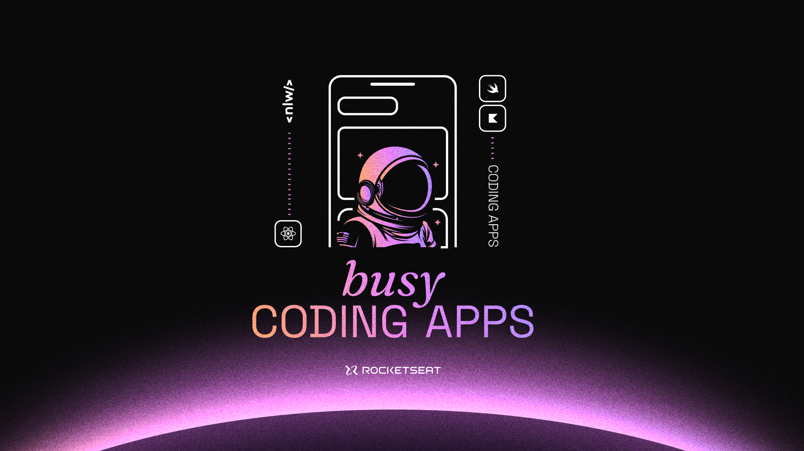

<h1 align="center">Projeto de App Mobile</h1>

NLW Pocket: Mobile (React Native) - Rocketseat/Rodrigo Gonçalves

  

## Tecnologias
Esse projeto foi desenvolvido utilizando as seguintes tecnologias:
- Expo
- React Native
- TypeScript
- Git & GitHub
- Figma

## Projeto
- O projeto é um aplicativo mobile feito com React Native, parmitindo ser executado em dispositivos Android e iOS, e também na Web.
- Este projeto é um aplicativo mobile com o intuito de ser um "mapa" de onde você pode encontrar os melhores lugares para se divertir, comer, beber, etc. Além disso, possui um sistema de cupons para obter "descontos e promoções" nos estabelecimentos.
- Ele foi criado com base em um design feito no Figma e utilizando as tecnologias Expo, React Native e TypeScript para a construção do site. O projeto também utiliza o Git e GitHub para versionamento e hospedagem do código. 
- Atualmente possui o mapa real, porém, com lugares fictícios, o que pode ser implementado com o tempo.
- A base para o projeto foi o evento NLW Pocket: Mobile (React Native) da Rocketseat, ministrado pelo educador Rodrigo Gonçalves.

Feito por João Lucas Lima Alexandre - 2024

<!--
Some help to everyone:

TypeScript have some features that the JavaScript doesn't, so you need to be pacient and have attencion to the documentation of the TypeScript. A lot of error can appear on it, and some of them affect the performance of the code. So, be careful with the types and the imports.

Everytime you will run the project, use "npx expo start" to start your expo app, then select your device to run with the commands.

When you want to run the app on a physical device, you will need to install the expo-go app on your device, then connect your device to your computer with a USB cable, or, if you have a wireless connection (like the wi-fi), you can use the expo-go app to connect your device to your computer (using the QR Code). After that, you can run the app on your device with the command "npx expo start --tunnel".

Everytime you will run your app, all the API request (when it's local), needs to be initialized with "npm start" on the folder of your API. 

On the config file, you need to change the "host" to "localhost" and the "port" to "3000" (the default port of the API) or the one that it's been initialize.

The map places are unreals, only created to be an example, but, they can be changed to real ones using react-native-maps and expo-location.
-->